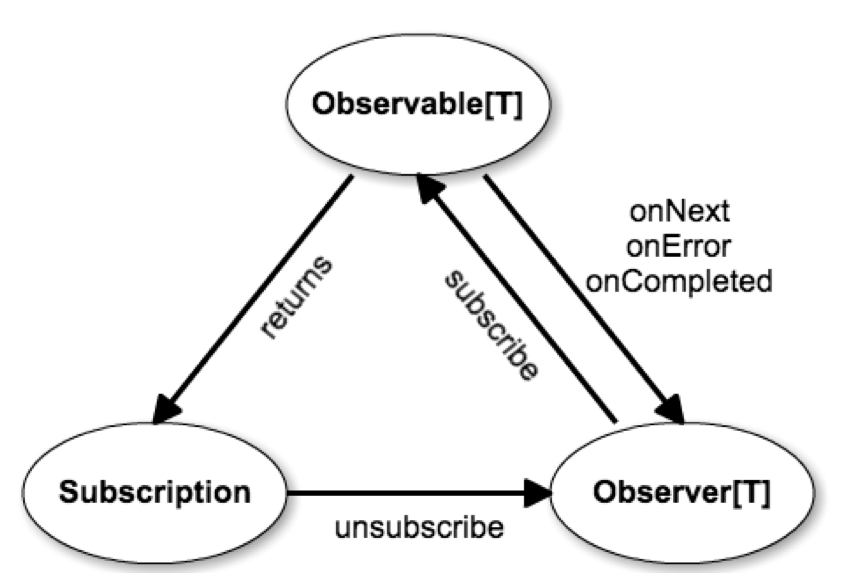

Observable
==========

Although we can model a lot of collections by using an `Iterable`, it is not suitable for all cases. For example, we are not
able to model a collection of real-time mouse moves, key presses or button clicks like an `Iterable`. These collections
do not have something like a `hasNext` and `next`. Instead, **events** come whenever they want to or when the environment
generates them. Their source is something that you cannot control, i.e. slow down, speed up or influence in any other way.
In other words, you cannot *pull* events from their source, but instead they are **pushed** to you. All you have to do is
listen to the collection (often called a *stream*) and **react** to the events that you receive.

It should be clear that there is an important distinction between these two types of collections. On the one hand we have
**interactive** collections (a subtype of `Iterable`) with which you interact by **pulling** the data from the collection.
You as a *consumer* are in charge of the rate at which the elements in the collection get processed, while the *producer*
of the data (the `Iterable`/`Iterator` combination) has to obey your commands and return a new element only when you want to.

On the other hand we have the **reactive** collection. Examples of this can be various kinds of real time data (mouse moves,
key presses, stock prices, sensor data), data that takes a long time to be computed for which you don't want to block your
program flow or data that has to come from an external source (network call, file I/O), for which you would normally have to
block your program flow as well. These kinds of collections do not have an interactive interface and you therefore cannot
pull the next element. Instead the data is **pushed** to you and you have to **react** to what you receive by processing
it in some way. Therefore the *producer* is fully in charge of how fast or how slow the data is streaming towards you,
whereas you as a *consumer* can only wait and react to what data comes in.

The library we discuss in this workshop (RxJava/RxScala) calls such a reactive collection an `Observable`. The next sections
will make clear why this name was chosen. For now, let's first juxtapose the two kinds of collections.

| Collection  | Java/Scala type | Interaction | In charge |
|-------------|-----------------|-------------|-----------|
| interactive | `Iterable`      | pull based  | consumer  |
| reactive    | `Observable`    | push based  | producer  |


Types of events
---------------
The contract of a reactive collection distinguishes three types of events that occur while the producer pushes elements
to the consumer:

  * The first type, **OnNext**, is the carrier of every element you receive. You can view it as a box with the element
    inside it. During the lifetime of a reactive collection, the producer will send 0 or more *OnNext* events to its consumer.
  * The second type of events is the **OnError** event. This event signals that something went wrong in the collection.
    An *OnError* event signals the sudden, exceptional 'death' of a reactive collection and after it no other event will
    or can ever occur! The *OnError* event carries the `Throwable` that caused its termination with it, so you can always
    see what caused this exceptional behavior and act accordingly.
  * Finally, the third type of event signals the normal and peaceful termination of a stream. Whenever the producer decides
    it will never send any *OnNext* events again, it will conclude the stream with an **OnCompleted** event. This is an
    empty event, it does not contain any value and can be considered as just a flag to signal to the consumer that no event
    will ever come after it.

In practice the *OnCompleted* and *OnError* events are a signal for the consumer to stop listening to the stream. As no
event will ever come after it, there is no need to continue observing the collection!

Given these three types of events, we can derive an interface that the consumer has to obey to in order to observe the
stream. It has to be able to accept each of these three events, `onNext`, `onError` and `onCompleted`. As the goal of this
interface is observe a stream of events, it is called `Observer`.

```scala
trait Observer[T] {
  def onNext(value: T): Unit
  def onError(error: Throwable): Unit
  def onCompleted(): Unit
}
```

Besides that, we can also define an interface for the reactive collection itself. The only thing it has to be able to do
is push events/data at the `Observer` that is listening (or subscribed) for them. In other words, it needs to be
`Observable` and has to allow an `Observer` to subscribe to it.
 
```scala
trait Observable[T] {
  def subscribe(observer: Observer[T]): Subscription
}
```

Finally, the `Subscription` that is returned by the `subscribe` method is used later to unsubscribe from the `Observable`
and therefore stop listening to the stream of events. `Subscription` therefore has the following interface:

```scala
trait Subscription {
  def isUnSubscribed: Boolean
  def unsubscribe(): Unit
}
```

In practice it turns out that you do not have to do anything with the `Subscription` in most cases. If the `Observable`
terminates (either with an *OnError* or *OnCompleted* event) it will automatically unsubscribe its `Observer`s from the
stream. You don't have to do anything with the `Subscription` yourself in those cases! For now we ignore this class and
only bring it up when necessary.

**To summarize:** when an `Observer` *subscribes* to an `Observable`, a `Subscription` is *returned*. From that point on,
the `Observer` receives all `onNext`, `onError` and `onCompleted` events that are produces by the `Observable`. Whenever
the `Observer` does not wish to receive any more events, it uses the `Subscription` to *unsubscribe*.




Streams of values
-----------------
With these three interfaces in place we can now start creating streams of values. Although most use cases of reactive
collections are in the realm of real-time data, non-blocking calculations or non-blocking I/O, it turns out that you can also use
interactive collections as the source of a stream. In this case the `Observable` emits the elements of the `Iterable` one by one
and considers them as events/data that is pushed to the `Observer`. Using an interactive source is especially useful for practising,
as you have full control over the source.

### Your first `Observable`
The simplest `Observable` is the one that emits a number of values as *OnNext* events and finishes with an *OnCompleted* event.

```scala
val emit123: Observable[Int] = Observable.just(1, 2, 3)
```

However, when you compile and run this code... nothing happens. That is because nobody is listening! These values in
`just(1, 2, 3)` will only be emitted if someone (i.e. at least one `Observer`) is actually listening to the stream.
If nobody listens, nothing happens!

> side note: there is a distinction between hot and cold streams (a.k.a. broadcasting vs. lazy), but we will get to
> that in workshop 5; for this workshop we only consider one `Observer` per stream.

To listen to a stream, we of course have to implement an `Observer`. In the code below we do this by printing custom
messages for each of the three event types. For each value that is emitted by the `Observable` (`1`, `2` and `3`) the
`onNext` method is executed, after which `onCompleted` is called. Note that even though we implemented `onError` here,
this method is never called!

```scala
def observer: Observer[Int] = new Observer[Int] {
  override def onNext(value: Int) =
    println(s"received onNext event with value: $value")

  override def onError(error: Throwable) =
    println(s"""received onError event of type ${error.getClass.getSimpleName} and message "${error.getMessage}"""")

  override def onCompleted() =
    println("received onCompleted event")
}
```

Now calling `emit123.subscribe(observer)` with give the following output:

```
received onNext event with value: 1
received onNext event with value: 2
received onNext event with value: 3
received onCompleted event
```

If you're following along by typing code: :bouquet::bouquet::bouquet: **Congratulations, you have made your first subscription!!!** :bouquet::bouquet::bouquet:

### Other primitive streams
As we just saw, you can create a stream with hardcoded elements using `Observable.just`. However, in some cases you may
prefer the source to be any arbitrary interactive collection that can be created or calculated on runtime. For this you
use `Observable.from` instead. You can supply any `Iterable` or one of its many subtypes as the argument of this function.

```scala
val emitFromList: Observable[Int] = Observable.from(List(1, 2, 3, 4))
emitFromList.subscribe(observer)
```

Using the `Observer` as defined above, we get the output below. Notice again that for each element in the collection the
`onNext` is called, followed by `onCompleted` at the end of the whole sequence.

```
received onNext event with value: 1
received onNext event with value: 2
received onNext event with value: 3
received onNext event with value: 4
received onCompleted event
```

Another primitive stream is the `Observable` that only emits an *OnError* event. Use the `Observable.error` for this with
an instance of `Throwable` as its argument. This stream does not emit any values but only terminates with an exception.

```scala
val emitError: Observable[Int] = Observable.error(new Exception("something went wrong"))
emitError.subscribe(observer)
```

This will generate the following output in the console:

```
received onError event of type Exception and message "something went wrong"
```

The obvious counterpart of `Observable.error` is `Observable.empty`, which also does not emit no values and only terminates
naturally with an *OnCompleted*.

```scala
val emitEmpty: Observable[Int] = Observable.empty
emitEmpty.subscribe(observer)
```

This of course gives the following console output:

```
received onCompleted event
```

Finally, we can also create a stream that does completely nothing: it does not emit any elements with *OnNext*, nor does it
terminate with *OnError* or *OnCompleted*. It will just run *forever* without doing anything! <sup>(my favorite `Observable`)</sup>
You can of course subscribe to this `Observable`, but you will never see any output with it.

```scala
val emitNever: Observable[Int] = Observable.never
emitNever.subscribe(observer)
```

### Anonymous `Observer`
Until now we have used an `Observer` instance that has to override and implement the `onNext`, `onError` and `onCompleted` methods.
Then we passed in this `Observer` to the `subscribe` method on `Observable`. However, we can also do this in a different way, by
passing the three implementations as lambda expressions to the `subscribe` method. In this case the `subscribe` will create the
`Observer` for you and pass it on to `subscribe(observer)`.

```scala
Observable.just(1, 2, 3).subscribe(
    value => println(s"received onNext event with value: $value"),
    error => println(s"""received onError event of type ${error.getClass.getSimpleName} and message "${error.getMessage}""""),
    () => println("received onCompleted event")
)
```

Similarly, we do not always need the implementation for all three event handlers. If we only want to handle the *OnNext* events and
discard the *OnError* and *OnCompleted* events, we only provide the first lambda expression. Note that these events still happen,
but that you just do not handle them!

```scala
Observable.just(1, 2, 3).subscribe(value => println(s"received onNext event with value: $value"))
```


Small exercises
---------------

1. Create an `Observable` that emits a number of hardcoded `String`s. (for example `"abc"`, `"def"`, `"ghi"`, `"jkl"` and `"mno"`)
2. Subscribe to this `Observable` and provide appropriate `println` statements for all three types of events.
3. Create a similar `Observable` that emits `List[Char]`s. (for example `['a', 'b', 'c']`, `['d', 'e', 'f']`, `['g', 'h', 'i']`, etc.)
4. Write a final `Observable[Char]` that given a `List[String]`, emits each `Char` in each `String` separately.
   **Hint:** a `String` can be converted to a `List[Char]` using `toList`

*To avoid spoilers, you can find the solution at the end of this section.* 


Where Rx is used
----------------

Rx views itself as "*a library for composing asynchronous and event based programs by using observable sequences*". The last words
already give away that we are talking about some kind of collection. The special thing is that the elements are not present on
beforehand, but instead that they come in at some arbitrary point in time. Only then can we get access to that particular element
and can we process it according to our liking.

Furthermore Rx can do *event based* and *asynchronous* programming. This means that we can send off a computationally or I/O heavy
operation to another thread or service and continue with other work without blocking the current thread while waiting for the result
of that operation. Instead of *waiting* until the computation has finished and *blocking* the thread or (continuously) *polling* whether
the computation is done, we create a 'channel' that sends the result to us whenever it is finished. Using the `subscribe` we specify
what should be done with the result whenever it comes in. In that way, we can keep working on other things while the operation is being
executed and *react* to the result coming in.

While the computation might only return a single value inside the `Observable`, we can also have multiple results coming in.
For example, if we want to execute a large query on a database, we can create an `Observable` such that each record is emitted
separately as the database computes the results. We don't wait for all results to be collected, but instead *react* to the individual
records coming in.

In that sense a computation is similar to the event streams in a user interface. As we will see later, each button press, mouse move
or key press is an event that may or may not require processing. Instead of having complex event handlers and often ending up in
'call-back hell', we can use Rx to wrap these events into `Observable` streams and process and combine them to our liking. Here it
is also important to have the asynchronous programming, as we want a user interface to still be responsive whenever it kicks off a
heavy operation. While waiting for the result(s), the user should still be able to interact with the application rather than finding
itself with a seemingly frozen screen.

Similar use cases are based on real-time data, such as stock tickers, clocks or doing [live sentiment analysis on a Twitter feed].
As you don't know when these events come in, it is quite practical to have you notified as soon as an event is coming in and process
it as soon as possible.

[live sentiment analysis on a Twitter feed]: https://vimeo.com/187941239


RxJava vs. RxScala
------------------
There are many libraries that make use of reactive programming these days. Most of them, however, are written in Java
and therefore expose the RxJava `Observable` rather than the RxScala one. There are, however, some slight syntactical
differences between RxJava and RxScala. A complete overview can be found on the [RxScala comparison page].

Conversion between RxJava and RxScala can be done (as of RxScala_2.11, v0.26.3) using the `asScala` and `asJava`
operators as shown below. *Note that you have to do an extra import to get this working!*

```scala
import rx.lang.scala.JavaConverters._

def javaObservableToScalaObservableConverter(): Unit = {

  // given a RxJava Observable (for example from some third party library) ...
  def getJavaObservableFromSomewhere: rx.Observable[Int] = {
    rx.Observable.just(1, 2, 3)
  }

  // ... it is possible to transform this into a RxScala Observable using `asScala`.
  getJavaObservableFromSomewhere
    .asScala
    .subscribe(println, _.printStackTrace(), () => println("done"))
}

def scalaObservableToJavaObservableConverter(): Unit = {

  // given a function that takes a RxJava Observable as its input and returns a RxJava Subscription ...
  def useJavaObservableSomewhere(obs: rx.Observable[_ <: Int]): rx.Subscription = {
    obs.subscribe(new Action1[Int] { override def call(i: Int): Unit = println(i) }) // RxJava requires an Action1 object here rather than a lambda expression.
  }

  val scalaObservable: Observable[Int] = Observable.just(1, 2, 3)

  // ... you can give a RxScala Observable as input and call `asJava`on it ...
  val javaSubscription: rx.Subscription = useJavaObservableSomewhere(scalaObservable.asJava)

   // ... after which you get a RxJava Subscription back, which can be used again in a RxScala setting using `asScalaSubscription` ...
  val scalaSubscription: Subscription = javaSubscription.asScalaSubscription

  // ... and convert it back to a RxJava Subscription using `asJavaSubscription`.
  val javaSubscriptionAgain: rx.Subscription = scalaSubscription.asJavaSubscription
}
```
 
[RxScala comparison page]: http://reactivex.io/rxscala/comparison.html


Solution to the small exercises
-------------------------------

1. Using `Observable.just` you can emit each `String` as a separate 'event', followed by an `onCompleted` event.

    ```scala
    Observable.just("abc", "def", "ghi", "jkl", "mno").subscribe(
      s => println(s"next String: $s"),
      e => println(s"an error occurred: ${e.getMessage}"),
      () => println("completed"))
    ```
2. Subscribe using the three lambdas above.
3. A first guess for emitting `List` might be to use `Observable.from`. However, this *takes* a `List` and emits each element
   *separately*. That is however not what we want! Instead we want to emit the `List`s themselves. Therefore we need to use
   `Observable.just` again and give these lists as its arguments.

    ```scala
    Observable.just(List('a', 'b', 'c'), List('d', 'e', 'f'), List('g', 'h', 'i')).subscribe(
      s => println(s"next list of characters: $s"),
      e => println(s"an error occurred: ${e.getMessage}"),
      () => println("completed"))
    ```
4. Since a `String` can be transformed into a `List[Char]` using `toList`, you can transform a `List[String]` into a `List[Char]`
   using `toList` and `flatMap`. You can then give this resulting `List[Char]` to the `Observable.from` that emits each `Char`
   in the `List` separately.
   
    ```scala
    Observable.from(List("abc", "def", "ghi").flatMap(_.toList)).subscribe(
     s => println(s"next character: $s"),
     e => println(s"an error occurred: ${e.getMessage}"),
     () => println("completed"))
    ```

